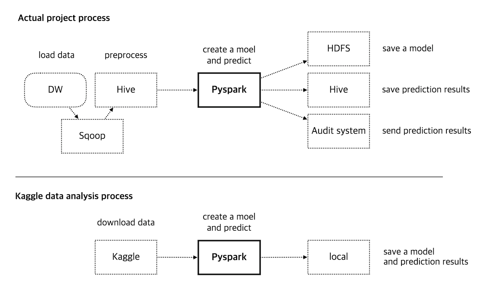
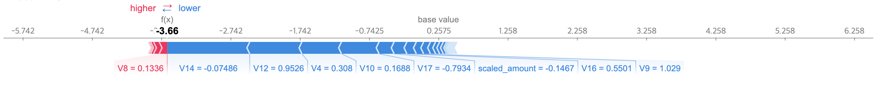
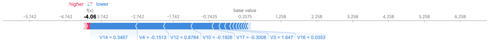
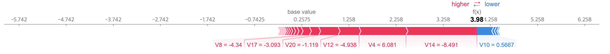
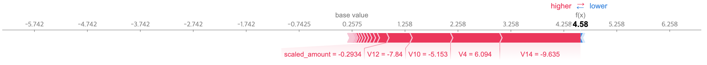
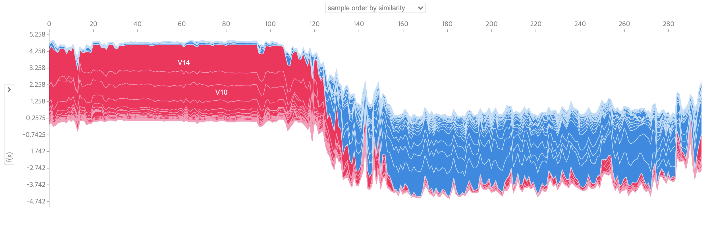

# Credit Card Fraud Detection

Also see: [notebook.ipynb](notebook.ipynb)

## Refs.

- Download Kaggle Datasets: [Credit Card Fraud Detection](https://www.kaggle.com/mlg-ulb/creditcardfraud)
- Reference: [Dealing with Imbalanced Datasets](https://www.kaggle.com/janiobachmann/credit-fraud-dealing-with-imbalanced-datasets) by Janio Martinez Bachmann

---

## About the project

### Background

- Credit card fraud continues to occur.
- Current audit systems require auditors to find out after fraud has already occurred.

### Goal

- Fraud Detection and Prevention
- Bank loss prevention and reputation management
- Increase audit efficiency and establish an integrated inspection management system
- Establishment of risk management system

### Differences from the actual project



- In the actual project, we used real data from the bank's audit team when developing the machine learning model.
- In this example, we'll use Kaggle's credit card fraud detection data instead of real data.
- This example shows one of the many models used.

---

## Setup project

- Conda Documentation: [Reinstall packages from an export file](https://docs.conda.io/projects/conda/en/latest/commands/list.html#Output,%20Prompt,%20and%20Flow%20Control%20Options)
- Conda Env: [Create a conda environment](https://github.com/rurumimic/python#create-a-conda-environment)

### Install all packages

```bash
conda create -n credit --file package-list.txt
```

### Manually

Create a env:

```bash
pyenv activate miniconda3-latest
conda create -n credit python=3.9.2
```

Activate and deactivate:

```bash
pyenv activate miniconda3-latest/envs/credit
pyenv deactivate
```

## Start JupyterLab

Install package:

```bash
conda install -c conda-forge jupyterlab
```

Start Lab:

```bash
jupyter lab
```

---

## Install Packages

- numpy
- pandas
- scikit
- scikit-optimize
- xgboost
- shap

```bash
conda install -c anaconda numpy pandas
conda install -c conda-forge scikit-learn scikit-optimize xgboost shap
```

## Datasets

Differences from the real datasets:

- Feature data type
   - All Kaggle data are normalized values.
   - Real data has a lot of categorical data.
- Number of features
   - Kaggle data contains 28 unnamed columns and time and amount information.
   - Real data has a lot of features.

Therefore, it is very different from the model that banks are actually using.


---
## Preprocess

### Load datasets


```python
import numpy as np
import pandas as pd
```


```python
df = pd.read_csv('creditcard.csv', sep=',')
```


```python
df.head()
```


<div>
<table border="1" class="dataframe">
  <thead>
    <tr style="text-align: right;">
      <th></th>
      <th>Time</th>
      <th>V1</th>
      <th>V2</th>
      <th>V3</th>
      <th>V4</th>
      <th>V5</th>
      <th>V6</th>
      <th>V7</th>
      <th>V8</th>
      <th>V9</th>
      <th>...</th>
      <th>V21</th>
      <th>V22</th>
      <th>V23</th>
      <th>V24</th>
      <th>V25</th>
      <th>V26</th>
      <th>V27</th>
      <th>V28</th>
      <th>Amount</th>
      <th>Class</th>
    </tr>
  </thead>
  <tbody>
    <tr>
      <th>0</th>
      <td>0.0</td>
      <td>-1.359807</td>
      <td>-0.072781</td>
      <td>2.536347</td>
      <td>1.378155</td>
      <td>-0.338321</td>
      <td>0.462388</td>
      <td>0.239599</td>
      <td>0.098698</td>
      <td>0.363787</td>
      <td>...</td>
      <td>-0.018307</td>
      <td>0.277838</td>
      <td>-0.110474</td>
      <td>0.066928</td>
      <td>0.128539</td>
      <td>-0.189115</td>
      <td>0.133558</td>
      <td>-0.021053</td>
      <td>149.62</td>
      <td>0</td>
    </tr>
    <tr>
      <th>1</th>
      <td>0.0</td>
      <td>1.191857</td>
      <td>0.266151</td>
      <td>0.166480</td>
      <td>0.448154</td>
      <td>0.060018</td>
      <td>-0.082361</td>
      <td>-0.078803</td>
      <td>0.085102</td>
      <td>-0.255425</td>
      <td>...</td>
      <td>-0.225775</td>
      <td>-0.638672</td>
      <td>0.101288</td>
      <td>-0.339846</td>
      <td>0.167170</td>
      <td>0.125895</td>
      <td>-0.008983</td>
      <td>0.014724</td>
      <td>2.69</td>
      <td>0</td>
    </tr>
    <tr>
      <th>2</th>
      <td>1.0</td>
      <td>-1.358354</td>
      <td>-1.340163</td>
      <td>1.773209</td>
      <td>0.379780</td>
      <td>-0.503198</td>
      <td>1.800499</td>
      <td>0.791461</td>
      <td>0.247676</td>
      <td>-1.514654</td>
      <td>...</td>
      <td>0.247998</td>
      <td>0.771679</td>
      <td>0.909412</td>
      <td>-0.689281</td>
      <td>-0.327642</td>
      <td>-0.139097</td>
      <td>-0.055353</td>
      <td>-0.059752</td>
      <td>378.66</td>
      <td>0</td>
    </tr>
    <tr>
      <th>3</th>
      <td>1.0</td>
      <td>-0.966272</td>
      <td>-0.185226</td>
      <td>1.792993</td>
      <td>-0.863291</td>
      <td>-0.010309</td>
      <td>1.247203</td>
      <td>0.237609</td>
      <td>0.377436</td>
      <td>-1.387024</td>
      <td>...</td>
      <td>-0.108300</td>
      <td>0.005274</td>
      <td>-0.190321</td>
      <td>-1.175575</td>
      <td>0.647376</td>
      <td>-0.221929</td>
      <td>0.062723</td>
      <td>0.061458</td>
      <td>123.50</td>
      <td>0</td>
    </tr>
    <tr>
      <th>4</th>
      <td>2.0</td>
      <td>-1.158233</td>
      <td>0.877737</td>
      <td>1.548718</td>
      <td>0.403034</td>
      <td>-0.407193</td>
      <td>0.095921</td>
      <td>0.592941</td>
      <td>-0.270533</td>
      <td>0.817739</td>
      <td>...</td>
      <td>-0.009431</td>
      <td>0.798278</td>
      <td>-0.137458</td>
      <td>0.141267</td>
      <td>-0.206010</td>
      <td>0.502292</td>
      <td>0.219422</td>
      <td>0.215153</td>
      <td>69.99</td>
      <td>0</td>
    </tr>
  </tbody>
</table>
<p>5 rows × 31 columns</p>
</div>


- Time: Elapsed time from previous transaction
- V1 to V28: Anonymized data
- Amount: amount
- Class
   - 0: normal
   - 1: scam

### Scaling

- [RobustScaler](https://scikit-learn.org/stable/modules/generated/sklearn.preprocessing.RobustScaler.html) is less prone to outliers.
- This Scaler removes the median and scales the data according to the quantile range.


```python
from sklearn.preprocessing import RobustScaler

rob_scaler = RobustScaler()
```

Scale `Time` and `Amount`:


```python
df['scaled_amount'] = rob_scaler.fit_transform(df['Amount'].values.reshape(-1,1))
df['scaled_time'] = rob_scaler.fit_transform(df['Time'].values.reshape(-1,1))
```

Remove `Time` and `Amount`:


```python
df.drop(['Amount', 'Time'], axis=1, inplace=True)
```

Change column order:


```python
scaled_amount = df['scaled_amount']
scaled_time = df['scaled_time']

df.drop(['scaled_amount', 'scaled_time'], axis=1, inplace=True)

df.insert(0, 'scaled_amount', scaled_amount)
df.insert(1, 'scaled_time', scaled_time)
```

Check changed data:


```python
df.head()
```


<div>
<table border="1" class="dataframe">
  <thead>
    <tr style="text-align: right;">
      <th></th>
      <th>scaled_amount</th>
      <th>scaled_time</th>
      <th>V1</th>
      <th>V2</th>
      <th>V3</th>
      <th>V4</th>
      <th>V5</th>
      <th>V6</th>
      <th>V7</th>
      <th>V8</th>
      <th>...</th>
      <th>V20</th>
      <th>V21</th>
      <th>V22</th>
      <th>V23</th>
      <th>V24</th>
      <th>V25</th>
      <th>V26</th>
      <th>V27</th>
      <th>V28</th>
      <th>Class</th>
    </tr>
  </thead>
  <tbody>
    <tr>
      <th>0</th>
      <td>1.783274</td>
      <td>-0.994983</td>
      <td>-1.359807</td>
      <td>-0.072781</td>
      <td>2.536347</td>
      <td>1.378155</td>
      <td>-0.338321</td>
      <td>0.462388</td>
      <td>0.239599</td>
      <td>0.098698</td>
      <td>...</td>
      <td>0.251412</td>
      <td>-0.018307</td>
      <td>0.277838</td>
      <td>-0.110474</td>
      <td>0.066928</td>
      <td>0.128539</td>
      <td>-0.189115</td>
      <td>0.133558</td>
      <td>-0.021053</td>
      <td>0</td>
    </tr>
    <tr>
      <th>1</th>
      <td>-0.269825</td>
      <td>-0.994983</td>
      <td>1.191857</td>
      <td>0.266151</td>
      <td>0.166480</td>
      <td>0.448154</td>
      <td>0.060018</td>
      <td>-0.082361</td>
      <td>-0.078803</td>
      <td>0.085102</td>
      <td>...</td>
      <td>-0.069083</td>
      <td>-0.225775</td>
      <td>-0.638672</td>
      <td>0.101288</td>
      <td>-0.339846</td>
      <td>0.167170</td>
      <td>0.125895</td>
      <td>-0.008983</td>
      <td>0.014724</td>
      <td>0</td>
    </tr>
    <tr>
      <th>2</th>
      <td>4.983721</td>
      <td>-0.994972</td>
      <td>-1.358354</td>
      <td>-1.340163</td>
      <td>1.773209</td>
      <td>0.379780</td>
      <td>-0.503198</td>
      <td>1.800499</td>
      <td>0.791461</td>
      <td>0.247676</td>
      <td>...</td>
      <td>0.524980</td>
      <td>0.247998</td>
      <td>0.771679</td>
      <td>0.909412</td>
      <td>-0.689281</td>
      <td>-0.327642</td>
      <td>-0.139097</td>
      <td>-0.055353</td>
      <td>-0.059752</td>
      <td>0</td>
    </tr>
    <tr>
      <th>3</th>
      <td>1.418291</td>
      <td>-0.994972</td>
      <td>-0.966272</td>
      <td>-0.185226</td>
      <td>1.792993</td>
      <td>-0.863291</td>
      <td>-0.010309</td>
      <td>1.247203</td>
      <td>0.237609</td>
      <td>0.377436</td>
      <td>...</td>
      <td>-0.208038</td>
      <td>-0.108300</td>
      <td>0.005274</td>
      <td>-0.190321</td>
      <td>-1.175575</td>
      <td>0.647376</td>
      <td>-0.221929</td>
      <td>0.062723</td>
      <td>0.061458</td>
      <td>0</td>
    </tr>
    <tr>
      <th>4</th>
      <td>0.670579</td>
      <td>-0.994960</td>
      <td>-1.158233</td>
      <td>0.877737</td>
      <td>1.548718</td>
      <td>0.403034</td>
      <td>-0.407193</td>
      <td>0.095921</td>
      <td>0.592941</td>
      <td>-0.270533</td>
      <td>...</td>
      <td>0.408542</td>
      <td>-0.009431</td>
      <td>0.798278</td>
      <td>-0.137458</td>
      <td>0.141267</td>
      <td>-0.206010</td>
      <td>0.502292</td>
      <td>0.219422</td>
      <td>0.215153</td>
      <td>0</td>
    </tr>
  </tbody>
</table>
<p>5 rows × 31 columns</p>
</div>


### Imbalanced datasets


```python
print('Normal', round(df['Class'].value_counts()[0]/len(df) * 100, 5), '%')
print('Fraud', round(df['Class'].value_counts()[1]/len(df) * 100, 5), '%')
```

    Normal 99.82725 %
    Fraud 0.17275 %


- Fraud data is less than 1% of the total data, which may overfit the model.
- We have to deal with imbalanced data.

### Random Under-Sampling

- When using real data, under/oversampling is not used.
- Because there was no significant change when sampling.
- Use undersampling when using Kaggle data.
- You can test quickly with a small training dataset.

Normal and Fraud:


```python
Normal = df[df['Class'] == 0]
Fraud = df[df['Class'] == 1]
```

Randomly select normal data:


```python
temp = Normal.sample(frac=1)
NormalSample = temp.loc[temp['Class'] == 0][:Fraud.shape[0]]
```

Merge data:


```python
UnderSample = pd.concat([Fraud, NormalSample]).sample(frac=1)
```

Check the undersampled data:


```python
UnderSample.shape
```


    (984, 31)


### Train and test data

Divide the data in a 7:3 ratio.


```python
from sklearn.model_selection import train_test_split
```


```python
X = UnderSample.drop('Class', axis=1)
y = UnderSample['Class']
```


```python
global X_train, y_train, X_test, y_test
X_train, X_test, y_train, y_test = train_test_split(X, y, test_size=0.3, random_state=1)
```

---
## Modeling


```python
from xgboost import XGBClassifier
from sklearn.metrics import auc, precision_recall_curve, confusion_matrix

from skopt import gp_minimize
from skopt.space import Space, Real, Integer, Categorical
from skopt.utils import use_named_args
```

Find the optimal parameter with `gp_minimize`:


```python
dimensions = [
    Real(low=1e-4, high=2e-1, prior='log-uniform', name='learning_rate'),
    Real(low=0, high=1, prior='uniform', name='reg_alpha'),
    Real(low=0, high=1, prior='uniform', name='reg_lambda'),
    Integer(low=20, high=1000, name='n_estimators'), 
    Real(low=1e-9, high=0.5, name='gamma'),
    Integer(low=2, high=10, name='max_depth')
]
```


```python
@use_named_args(dimensions)
def fitness(**params):
    params['eval_metric'] = 'aucpr'
    
    model = XGBClassifier()
    model.set_params(**params)
    model.fit(X_train, y_train)
    y_proba = model.predict_proba(X_test)
    
    precision, recall, _ = precision_recall_curve(y_test, y_proba[:, 1])
    auc_pr = auc(recall, precision)
    
    params.pop('eval_metric')
    params['aucpr'] = auc_pr
    
    return 1 - auc_pr
```


```python
gp_result = gp_minimize(fitness, dimensions, n_jobs = 5, n_calls = 10)
```


```python
dimension_names = [x.name for x in dimensions]
best_params = {}

for i in range(len(dimension_names)):
    best_params[dimension_names[i]] = gp_result['x'][i]

best_params['eval_metric'] = 'aucpr'
best_params['n_jobs'] = 5
```


```python
best_params
```


    {'learning_rate': 0.010502347160991049,
     'reg_alpha': 0.26304039594088163,
     'reg_lambda': 0.9689289216806913,
     'n_estimators': 412,
     'gamma': 0.21935353045195558,
     'max_depth': 5,
     'eval_metric': 'aucpr',
     'n_jobs': 5}


Use the optimal parameters and create a model:


```python
model = XGBClassifier()
model.set_params(**best_params)
model.fit(X_train, y_train)
y_proba = model.predict_proba(X_test)

precision, recall, _ = precision_recall_curve(y_test, y_proba[:, 1])
auc_pr = auc(recall, precision)
cm = confusion_matrix(y_test, y_proba[:, 1]>0.5)

model.performance_indicator = {}
model.performance_indicator['aucpr'] = auc_pr
model.performance_indicator['confusion_matrix'] = cm
model.train_col = list(X_train.columns)
```

Check the model performance metrics:


```python
pd.DataFrame({"predict false": [cm[0][0], cm[0][1]], \
              "predict true": [cm[1][0], cm[1][1]]})\
.rename(index = {0:'actual false', 1:'actual true'})
```


<div>
<table border="1" class="dataframe">
  <thead>
    <tr style="text-align: right;">
      <th></th>
      <th>predict false</th>
      <th>predict true</th>
    </tr>
  </thead>
  <tbody>
    <tr>
      <th>actual false</th>
      <td>155</td>
      <td>10</td>
    </tr>
    <tr>
      <th>actual true</th>
      <td>2</td>
      <td>129</td>
    </tr>
  </tbody>
</table>
</div>


| | predict false | predict true |
|---|---|---|
| actual false | True Negatives | False Positives <br> (Type I error) |
| actual true | False Negatives <br> (Type II error) | True Positives |


```python
auc_pr # Area Under Precision Recall Curve
```


    0.9877179994298837


---
## Prediction

### SHAP


```python
import shap
import random
```

SHAP:


```python
def _shap(model, X):
    explainer = shap.TreeExplainer(model, data=X)
    shap_values = explainer.shap_values(X)
    df_shap_values = pd.DataFrame(explainer.shap_values(X), columns = X.columns.values)
    
    df_importances = pd.DataFrame(columns=['fraud column 1', 'fraud value 1', 'fraud weight 1', 
                                           'fraud column 2', 'fraud value 2', 'fraud weight 2', 
                                           'fraud column 3', 'fraud value 3', 'fraud weight 3', 
                                           'fraud column 4', 'fraud value 4', 'fraud weight 4', 
                                           'fraud column 5', 'fraud value 5', 'fraud weight 5', 
                                           'normal column 1', 'normal value 1', 'normal weight 1', 
                                           'normal column 2', 'normal value 2', 'normal weight 2',
                                           'normal column 3', 'normal value 3', 'normal weight 3',
                                           'normal column 4', 'normal value 4', 'normal weight 4',
                                           'normal column 5', 'normal value 5', 'normal weight 5'])

    for i in range(len(X)):
        importance = sorted(zip(X.columns, X.values[i], df_shap_values.iloc[i, :]), key=lambda x: x[2], reverse=True)
        frd_imp = importance[:5]
        importance = sorted(zip(X.columns, X.values[i], -1 * df_shap_values.iloc[i, :]), key=lambda x: x[2], reverse=True)
        norm_imp = importance[:5]

        frd_imp.extend(norm_imp)
        df_importances.loc[i] = list(sum(frd_imp, ()))
        
    df_importances.insert(0, 'index', X.index.values)
    
    return explainer, shap_values, df_importances
```

Graph:


```python
shap.initjs()
```

```python
def AdditiveForceVisualizer(data, explainer, shap_values, X):   
    row_id = data.index.values[0]
    data_id = data['index'].values[0]
    data_class = data['isFraud'].values[0]
    data_fraud = "%.1f" % data['Fraud %'].values[0]

    print(f"{data_id} is Normal" if data_class == 0 else f"{data_id} is Fraud")
    print(f"Fraud: {data_fraud}%")
    plt = shap.force_plot(explainer.expected_value, shap_values[row_id,:], X.iloc[row_id,:], show=False)
    return plt

def Visualizer(importances, explainer, shap_values, X, Class_value = 1):
    data = importances.loc[importances['isFraud'] == Class_value]
    random_index = random.randint(0, len(data))
    data = data.iloc[[random_index]]
    return AdditiveForceVisualizer(data, explainer, shap_values, X), data

def FactorTable(data):
    return pd.DataFrame({
        'fraud column': [data['fraud column 1'].values[0], data['fraud column 2'].values[0], data['fraud column 3'].values[0], data['fraud column 4'].values[0], data['fraud column 5'].values[0]],
        'fraud value': [data['fraud value 1'].values[0], data['fraud value 2'].values[0], data['fraud value 3'].values[0], data['fraud value 4'].values[0], data['fraud value 5'].values[0]],
        'fraud weight': [data['fraud weight 1'].values[0], data['fraud weight 2'].values[0], data['fraud weight 3'].values[0], data['fraud weight 4'].values[0], data['fraud weight 5'].values[0]],
        'normal column': [data['normal column 1'].values[0], data['normal column 2'].values[0], data['normal column 3'].values[0], data['normal column 4'].values[0], data['normal column 5'].values[0]],
        'normal value': [data['normal value 1'].values[0], data['normal value 2'].values[0], data['normal value 3'].values[0], data['normal value 4'].values[0], data['normal value 5'].values[0]],
        'normal weight': [data['normal weight 1'].values[0], data['normal weight 2'].values[0], data['normal weight 3'].values[0], data['normal weight 4'].values[0], data['normal weight 5'].values[0]],
    }).rename(index = {0:'1', 1:'2', 2:'3', 3:'4', 4:'5'})
```

### Predict


```python
y_pred = model.predict_proba(X_test)
```


```python
explainer, shap_values, importances = _shap(model, X_test)
```


```python
importances.insert(1, 'isFraud', y_test.values)
importances.insert(2, 'Fraud %', (y_pred[:,1] * 100).round(1))
importances.head()
```


<div>
<table border="1" class="dataframe">
  <thead>
    <tr style="text-align: right;">
      <th></th>
      <th>index</th>
      <th>isFraud</th>
      <th>Fraud %</th>
      <th>fraud column 1</th>
      <th>fraud value 1</th>
      <th>fraud weight 1</th>
      <th>fraud column 2</th>
      <th>fraud value 2</th>
      <th>fraud weight 2</th>
      <th>fraud column 3</th>
      <th>...</th>
      <th>normal weight 2</th>
      <th>normal column 3</th>
      <th>normal value 3</th>
      <th>normal weight 3</th>
      <th>normal column 4</th>
      <th>normal value 4</th>
      <th>normal weight 4</th>
      <th>normal column 5</th>
      <th>normal value 5</th>
      <th>normal weight 5</th>
    </tr>
  </thead>
  <tbody>
    <tr>
      <th>0</th>
      <td>10897</td>
      <td>1</td>
      <td>99.0</td>
      <td>V14</td>
      <td>-14.666389</td>
      <td>1.521694</td>
      <td>V4</td>
      <td>11.165526</td>
      <td>0.830132</td>
      <td>V10</td>
      <td>...</td>
      <td>0.042960</td>
      <td>V28</td>
      <td>-1.178063</td>
      <td>0.019617</td>
      <td>V13</td>
      <td>0.345179</td>
      <td>0.002714</td>
      <td>V25</td>
      <td>0.995271</td>
      <td>0.001054</td>
    </tr>
    <tr>
      <th>1</th>
      <td>264487</td>
      <td>0</td>
      <td>2.2</td>
      <td>V12</td>
      <td>-1.331926</td>
      <td>0.124920</td>
      <td>V8</td>
      <td>-0.079729</td>
      <td>0.118850</td>
      <td>V23</td>
      <td>...</td>
      <td>1.148552</td>
      <td>V10</td>
      <td>0.400928</td>
      <td>0.780538</td>
      <td>V17</td>
      <td>0.172528</td>
      <td>0.195458</td>
      <td>V11</td>
      <td>-1.485025</td>
      <td>0.173763</td>
    </tr>
    <tr>
      <th>2</th>
      <td>223750</td>
      <td>0</td>
      <td>39.5</td>
      <td>V4</td>
      <td>4.432757</td>
      <td>1.239237</td>
      <td>V7</td>
      <td>2.619744</td>
      <td>0.268762</td>
      <td>V18</td>
      <td>...</td>
      <td>0.750119</td>
      <td>V10</td>
      <td>0.769091</td>
      <td>0.247326</td>
      <td>V8</td>
      <td>0.804989</td>
      <td>0.201418</td>
      <td>V16</td>
      <td>0.496301</td>
      <td>0.125464</td>
    </tr>
    <tr>
      <th>3</th>
      <td>115258</td>
      <td>0</td>
      <td>7.4</td>
      <td>V4</td>
      <td>2.385177</td>
      <td>0.814506</td>
      <td>V8</td>
      <td>-0.123559</td>
      <td>0.226464</td>
      <td>V21</td>
      <td>...</td>
      <td>0.869566</td>
      <td>V11</td>
      <td>-0.776345</td>
      <td>0.415647</td>
      <td>V10</td>
      <td>0.672238</td>
      <td>0.357633</td>
      <td>V17</td>
      <td>-0.694183</td>
      <td>0.260896</td>
    </tr>
    <tr>
      <th>4</th>
      <td>83417</td>
      <td>1</td>
      <td>99.0</td>
      <td>V14</td>
      <td>-6.233044</td>
      <td>1.637585</td>
      <td>V10</td>
      <td>-3.252634</td>
      <td>0.919460</td>
      <td>V4</td>
      <td>...</td>
      <td>0.041765</td>
      <td>V2</td>
      <td>-0.364223</td>
      <td>0.026712</td>
      <td>scaled_amount</td>
      <td>-0.224831</td>
      <td>0.018689</td>
      <td>V20</td>
      <td>0.019626</td>
      <td>0.012300</td>
    </tr>
  </tbody>
</table>
<p>5 rows × 33 columns</p>
</div>


### Results

#### Normal Prediction 1


```python
normal_graph, normal_data = Visualizer(importances, explainer, shap_values, X_test, 0)
normal_graph
```

265064 is Normal  
Fraud: 2.5%  




```python
FactorTable(normal_data)
```


<div>
<table border="1" class="dataframe">
  <thead>
    <tr style="text-align: right;">
      <th></th>
      <th>fraud column</th>
      <th>fraud value</th>
      <th>fraud weight</th>
      <th>normal column</th>
      <th>normal value</th>
      <th>normal weight</th>
    </tr>
  </thead>
  <tbody>
    <tr>
      <th>1</th>
      <td>V8</td>
      <td>0.133578</td>
      <td>0.115034</td>
      <td>V14</td>
      <td>-0.074863</td>
      <td>1.191437</td>
    </tr>
    <tr>
      <th>2</th>
      <td>V18</td>
      <td>0.508021</td>
      <td>0.081165</td>
      <td>V12</td>
      <td>0.952566</td>
      <td>0.752598</td>
    </tr>
    <tr>
      <th>3</th>
      <td>V22</td>
      <td>0.765636</td>
      <td>0.041775</td>
      <td>V4</td>
      <td>0.308000</td>
      <td>0.571277</td>
    </tr>
    <tr>
      <th>4</th>
      <td>V24</td>
      <td>-0.337410</td>
      <td>0.023267</td>
      <td>V10</td>
      <td>0.168784</td>
      <td>0.542509</td>
    </tr>
    <tr>
      <th>5</th>
      <td>V3</td>
      <td>-0.313453</td>
      <td>0.005547</td>
      <td>V17</td>
      <td>-0.793385</td>
      <td>0.217275</td>
    </tr>
  </tbody>
</table>
</div>


#### Normal Prediction 2


```python
normal_graph, normal_data = Visualizer(importances, explainer, shap_values, X_test, 0)
normal_graph
```

30113 is Normal  
Fraud: 1.7%  




```python
FactorTable(normal_data)
```


<div>
<table border="1" class="dataframe">
  <thead>
    <tr style="text-align: right;">
      <th></th>
      <th>fraud column</th>
      <th>fraud value</th>
      <th>fraud weight</th>
      <th>normal column</th>
      <th>normal value</th>
      <th>normal weight</th>
    </tr>
  </thead>
  <tbody>
    <tr>
      <th>1</th>
      <td>V8</td>
      <td>0.196714</td>
      <td>0.106228</td>
      <td>V14</td>
      <td>0.346724</td>
      <td>1.318384</td>
    </tr>
    <tr>
      <th>2</th>
      <td>V11</td>
      <td>1.730901</td>
      <td>0.029039</td>
      <td>V4</td>
      <td>-0.151329</td>
      <td>0.776884</td>
    </tr>
    <tr>
      <th>3</th>
      <td>V9</td>
      <td>-0.697704</td>
      <td>0.023541</td>
      <td>V12</td>
      <td>0.878358</td>
      <td>0.765717</td>
    </tr>
    <tr>
      <th>4</th>
      <td>V2</td>
      <td>0.965899</td>
      <td>0.008261</td>
      <td>V10</td>
      <td>-0.192583</td>
      <td>0.586084</td>
    </tr>
    <tr>
      <th>5</th>
      <td>scaled_time</td>
      <td>-0.574654</td>
      <td>0.004383</td>
      <td>V17</td>
      <td>-0.300795</td>
      <td>0.192240</td>
    </tr>
  </tbody>
</table>
</div>


#### Fraud Prediction 1


```python
fraud_graph, fraud_data = Visualizer(importances, explainer, shap_values, X_test, 1)
fraud_graph
```

167305 is Fraud  
Fraud: 98.2%  




```python
FactorTable(fraud_data)
```


<div>
<table border="1" class="dataframe">
  <thead>
    <tr style="text-align: right;">
      <th></th>
      <th>fraud column</th>
      <th>fraud value</th>
      <th>fraud weight</th>
      <th>normal column</th>
      <th>normal value</th>
      <th>normal weight</th>
    </tr>
  </thead>
  <tbody>
    <tr>
      <th>1</th>
      <td>V14</td>
      <td>-8.490813</td>
      <td>1.505348</td>
      <td>V10</td>
      <td>0.566680</td>
      <td>0.355581</td>
    </tr>
    <tr>
      <th>2</th>
      <td>V4</td>
      <td>6.081321</td>
      <td>0.995539</td>
      <td>scaled_amount</td>
      <td>1.172221</td>
      <td>0.054561</td>
    </tr>
    <tr>
      <th>3</th>
      <td>V12</td>
      <td>-4.938284</td>
      <td>0.443508</td>
      <td>V26</td>
      <td>0.466165</td>
      <td>0.051041</td>
    </tr>
    <tr>
      <th>4</th>
      <td>V20</td>
      <td>-1.118687</td>
      <td>0.412202</td>
      <td>V5</td>
      <td>-1.636071</td>
      <td>0.028655</td>
    </tr>
    <tr>
      <th>5</th>
      <td>V17</td>
      <td>-3.093013</td>
      <td>0.195621</td>
      <td>V6</td>
      <td>0.500610</td>
      <td>0.001199</td>
    </tr>
  </tbody>
</table>
</div>


#### Fraud Prediction 2


```python
fraud_graph, fraud_data = Visualizer(importances, explainer, shap_values, X_test, 1)
fraud_graph
```

8312 is Fraud  
Fraud: 99.0%  




```python
FactorTable(fraud_data)
```


<div>
<table border="1" class="dataframe">
  <thead>
    <tr style="text-align: right;">
      <th></th>
      <th>fraud column</th>
      <th>fraud value</th>
      <th>fraud weight</th>
      <th>normal column</th>
      <th>normal value</th>
      <th>normal weight</th>
    </tr>
  </thead>
  <tbody>
    <tr>
      <th>1</th>
      <td>V14</td>
      <td>-9.634690</td>
      <td>1.524121</td>
      <td>V26</td>
      <td>0.521884</td>
      <td>0.053495</td>
    </tr>
    <tr>
      <th>2</th>
      <td>V4</td>
      <td>6.094141</td>
      <td>0.930637</td>
      <td>V20</td>
      <td>0.440439</td>
      <td>0.007345</td>
    </tr>
    <tr>
      <th>3</th>
      <td>V10</td>
      <td>-5.153095</td>
      <td>0.766357</td>
      <td>V13</td>
      <td>1.371819</td>
      <td>0.007026</td>
    </tr>
    <tr>
      <th>4</th>
      <td>V12</td>
      <td>-7.839539</td>
      <td>0.439015</td>
      <td>V21</td>
      <td>0.149896</td>
      <td>0.006568</td>
    </tr>
    <tr>
      <th>5</th>
      <td>scaled_amount</td>
      <td>-0.293440</td>
      <td>0.178986</td>
      <td>V7</td>
      <td>-0.591118</td>
      <td>0.005215</td>
    </tr>
  </tbody>
</table>
</div>


#### All predictions


```python
shap.force_plot(explainer.expected_value, shap_values, X_test)
```



---
## About a model


```python
model
```


    XGBClassifier(base_score=0.5, booster='gbtree', colsample_bylevel=1,
                  colsample_bynode=1, colsample_bytree=1, eval_metric='aucpr',
                  gamma=0.21935353045195558, gpu_id=-1, importance_type='gain',
                  interaction_constraints='', learning_rate=0.010502347160991049,
                  max_delta_step=0, max_depth=5, min_child_weight=1, missing=nan,
                  monotone_constraints='()', n_estimators=412, n_jobs=5,
                  num_parallel_tree=1, random_state=0,
                  reg_alpha=0.26304039594088163, reg_lambda=0.9689289216806913,
                  scale_pos_weight=1, subsample=1, tree_method='exact',
                  validate_parameters=1, verbosity=None)


### Model's performances


```python
model.performance_indicator
```


    {'aucpr': 0.9877179994298837,
     'confusion_matrix': array([[155,   2],
            [ 10, 129]])}


### Prediction Results


```python
pd.DataFrame(y_pred).set_index(X_test.index).head()
```


<div>
<table border="1" class="dataframe">
  <thead>
    <tr style="text-align: right;">
      <th></th>
      <th>0</th>
      <th>1</th>
    </tr>
  </thead>
  <tbody>
    <tr>
      <th>10897</th>
      <td>0.010107</td>
      <td>0.989893</td>
    </tr>
    <tr>
      <th>264487</th>
      <td>0.977587</td>
      <td>0.022413</td>
    </tr>
    <tr>
      <th>223750</th>
      <td>0.605342</td>
      <td>0.394658</td>
    </tr>
    <tr>
      <th>115258</th>
      <td>0.925676</td>
      <td>0.074324</td>
    </tr>
    <tr>
      <th>83417</th>
      <td>0.009993</td>
      <td>0.990007</td>
    </tr>
  </tbody>
</table>
</div>


---
## Save a model and predictions


```python
from joblib import dump
```


```python
dump(model, 'model')
pd.DataFrame(y_pred).set_index(X_test.index).to_csv('predictions.csv', mode='w')
importances.to_csv('importances.csv', mode='w')
```
